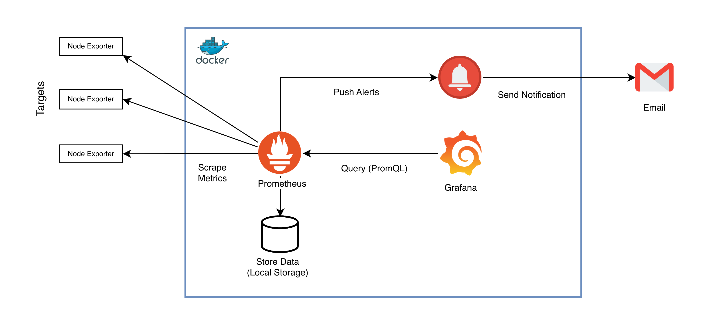

# AWS Monitoring Platform


A cost-efficient monitoring platform designed for SME production environments.

Deployed on AWS using Terraform and Docker Compose, it provides centralized infrastructure metrics, website uptime checks and SSL certificate expiry monitoring.

Built with Prometheus, Grafana, Alertmanager, Node Exporter and Blackbox Exporter, the platform is managed through GitHub Actions CI/CD with secure AWS OIDC authentication.

---

## Architecture



---

## Technology Stack

| Area | Technology |
|---|---|
| Cloud Provider | AWS |
| Compute | Amazon EC2 |
| Infrastructure as Code | Terraform |
| Configuration Deployment | GitHub Actions |
| AWS Authentication | GitHub OIDC |
| Remote Execution | AWS Systems Manager |
| Config Storage | Amazon S3 |
| Monitoring Engine | Prometheus |
| Visualization | Grafana |
| Alert Routing | Alertmanager |
| Website Probing | Blackbox Exporter |
| Reverse Proxy | NGINX |
| Container Runtime | Docker Compose |
| Linux Metrics | Node Exporter |
| Static Analysis | tfsec, tflint |

---

## Repository Structure

```
aws-monitoring-platform/
├── README.md
├── LICENSE
├── bootstrap/
│   └── user_data.sh
├── config/
│   ├── alertmanager/
│   │   └── alertmanager.yml
│   ├── blackbox/
│   │   └── blackbox.yml
│   ├── docker-compose.yml
│   ├── grafana/
│   │   ├── dashboards/
│   │   │   ├── server-monitoring.json
│   │   │   └── website-monitoring.json
│   │   └── provisioning/
│   │       ├── dashboards/
│   │       │   └── dashboard-provider.yml
│   │       └── datasources/
│   │           └── prometheus.yml
│   ├── nginx/
│   │   └── default.conf
│   └── prometheus/
│       ├── alerts.yml
│       ├── prometheus.yml
│       └── targets/
│           ├── servers.json.example
│           └── websites.json.example
├── environments/
│   ├── dev/
│   └── prod/
└── modules/
    ├── backup/
    ├── ec2/
    ├── eip/
    ├── iam/
    ├── naming/
    └── security/
```

---

## Features

### Dashboards as Code

Grafana dashboards are provisioned from JSON files in `config/grafana/dashboards/`. Changes are deployed via GitHub Actions and take effect on the next Grafana reload.

### GitOps Configuration Deployment

All changes under `config/` are deployed automatically by GitHub Actions on push to `main`.

---

## Prerequisites

Tools required on your local workstation:
- Terraform >= 1.10
- AWS CLI
- Docker
- tflint
- tfsec

AWS requirements:
- Existing VPC and public subnet
- EC2 key pair
- DNS provider
- GitHub repository with Actions enabled

---

## Setup Guide

### Step 1 — Clone the Repository

```bash
git clone https://github.com/kothetzawtun/aws-monitoring-platform.git
cd aws-monitoring-platform
```

### Step 2 — Configure Terraform Variables

```bash
cd environments/dev
cp terraform.tfvars.example terraform.tfvars
```

Example `terraform.tfvars`:

```hcl
org                   = "company"
project               = "monitoring"
environment           = "dev"
owner                 = "devops"
aws_region            = "ap-southeast-1"
vpc_id                = "vpc-xxxxxxxx"
public_subnet_id      = "subnet-xxxxxxxx"
instance_type         = "t3.small"
key_name              = "demo-key"
ssh_allowed_cidrs     = ["YOUR_IP_ADDRESS/32"]
root_volume_size      = 20
data_volume_size      = 50
domain_name           = "monitor-dev.example.com"
backup_retention_days = 3
config_bucket         = "demo-monitoring-config"
github_org_repo       = "your-github-name/aws-monitoring-platform"
```

> Do not commit `terraform.tfvars` to a public repository.

### Step 3 — Store Grafana Password in SSM

```bash
aws ssm put-parameter \
  --name "/monitoring/dev/grafana/password" \
  --type "SecureString" \
  --value "REPLACE_WITH_SECURE_PASSWORD" \
  --region ap-southeast-1
```

### Step 4 — Deploy Infrastructure

```bash
terraform init
terraform validate
terraform plan
terraform apply
```

Record outputs after apply:
- EC2 instance ID
- Elastic IP address
- GitHub deploy role ARN

### Step 5 — Configure DNS

```
monitor-dev.example.com > Elastic IP
```

### Step 6 — Configure GitHub Actions Variables

Go to: **Repository > Settings > Secrets and variables > Actions > Variables**

| Variable | Example |
|---|---|
| AWS_REGION | ap-southeast-1 |
| AWS_DEPLOY_ROLE_ARN | arn:aws:iam::123456789012:role/demo-monitoring-dev-github-deploy |
| MONITORING_INSTANCE_ID | i-xxxxxxxxxxxxxxxxx |
| MONITORING_CONFIG_BUCKET | demo-monitoring-config |
| MONITORING_ENVIRONMENT | dev |
| MONITORING_DOMAIN | monitor-dev.example.com |

### Step 7 — Configure Monitoring Targets

```bash
cp config/prometheus/targets/servers.json.example \
   config/prometheus/targets/servers.json

cp config/prometheus/targets/websites.json.example \
   config/prometheus/targets/websites.json
```

Edit `servers.json`:

```json
[
  {
    "targets": ["10.0.1.10:9100"],
    "labels": {
      "client_name": "Client-A",
      "server_name": "app-server-01",
      "environment": "prod"
    }
  }
]
```

Edit `websites.json`:

```json
[
  {
    "targets": ["https://example.com"],
    "labels": {
      "client_name": "Client-B",
      "service_name": "main-site",
      "environment": "prod"
    }
  }
]
```

### Step 8 — Deploy Configuration

```bash
git add config/
git commit -m "Initial monitoring configuration"
git push origin main
```

---

## Access

| Service | URL | Access |
|---|---|---|
| Grafana | https://monitor.example.com | Public HTTPS + login |
| Prometheus | https://monitor.example.com/prometheus | IP allowlisted |
| Alertmanager | https://monitor.example.com/alertmanager | IP allowlisted |


---

## NGINX IP Allowlist

Prometheus and Alertmanager are restricted by IP in `config/nginx/default.conf`.

Update allowed CIDRs and push:

```bash
git add config/nginx/default.conf
git commit -m "Update NGINX IP allowlist"
git push origin main
```

---

## Cost Estimate (ap-southeast-1)

| Resource | Spec | Monthly |
|---|---|---|
| EC2 | t3.small (dev) / t3.medium (prod) | ~$17 / ~$34 |
| EBS data | 50GB dev / 200GB prod gp3 | ~$4 / ~$16 |
| EBS root | 20GB gp3 | ~$1.60 |
| Snapshots | 3-day dev / 7-day prod | ~$1 / ~$5 |
| S3 | config bucket | ~$0.50 |
| SSM | Session Manager | $0 |
| **Dev total** | | **~$24/month** |
| **Prod total** | | **~$58/month** |

> Costs are estimates only and may vary by AWS region, usage, backup retention and data transfer.

---

## Security Controls

- GitHub OIDC — no long-lived AWS credentials in GitHub
- IMDSv2 enforced on EC2
- Encrypted EBS volumes
- Least-privilege IAM roles
- SSM Session Manager for administration
- NGINX IP allowlist for Prometheus and Alertmanager
- SSH restricted to configured CIDR ranges
- All configuration changes tracked in Git

---


## Author

**Thet Zaw Tun**
Cloud Engineer | Cloud Infrastructure | AWS | Terraform

[](https://linkedin.com/in/thetzawtun)
[](https://github.com/kothetzawtun)

---

## License

This project is licensed under the MIT License.
